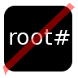

# Not root, install APT packages without root access

This simple tool allow you to install apt packages without root
access.

## Installing

First, clone this repository:

    git clone https://github.com/Gregwar/notroot.git

Then, add this line to your `.bashrc` file:

    source "$HOME/notroot/bashrc"

(You can adapt the path to the `notroot` directory)

Then, reload bash.

## Usage

Simply run something like this:

    notroot install libjsoncpp-dev libjsoncpp0

This will download and extract packages.

## Support 

Note that this is a minimalist script designed to install libraries 
and binaries without root access, the following are supported:

* Binaries (using `PATH`)
* Includes (using `CPATH`)
* Libraries (using `LIBRARY_PATH` and `LD_LIBRARY_PATH`)

